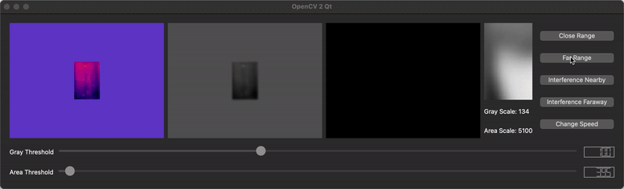
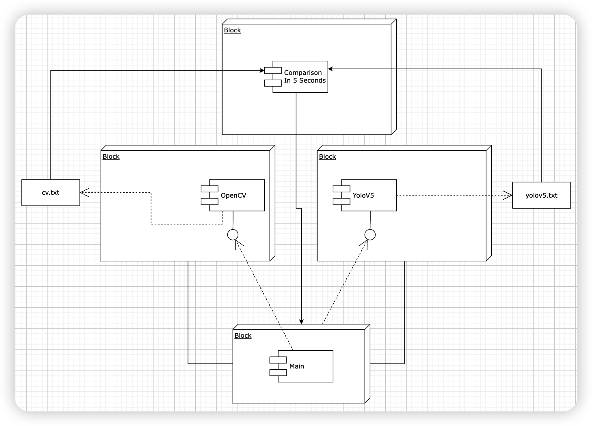

# Smoke-Monitor

Hi，欢迎来到这里！项目分为以下几个部分

## InfraredLight-OpenCV

此文件夹下实现红外源的运动烟雾识别。

目前实现效果如图：

## VisibleLight-DeepLearning

此文件夹下实现可见光的运动烟雾识别。

## 联调

通过打印日志的方法，记录每个时间戳内的双源监测信息，包括是否有险情，险情在图像上的坐标等。

如若一定时阈内，红外部分和可见光部分报警区域重叠，视为真正报警。

